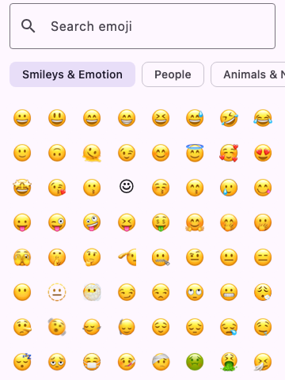
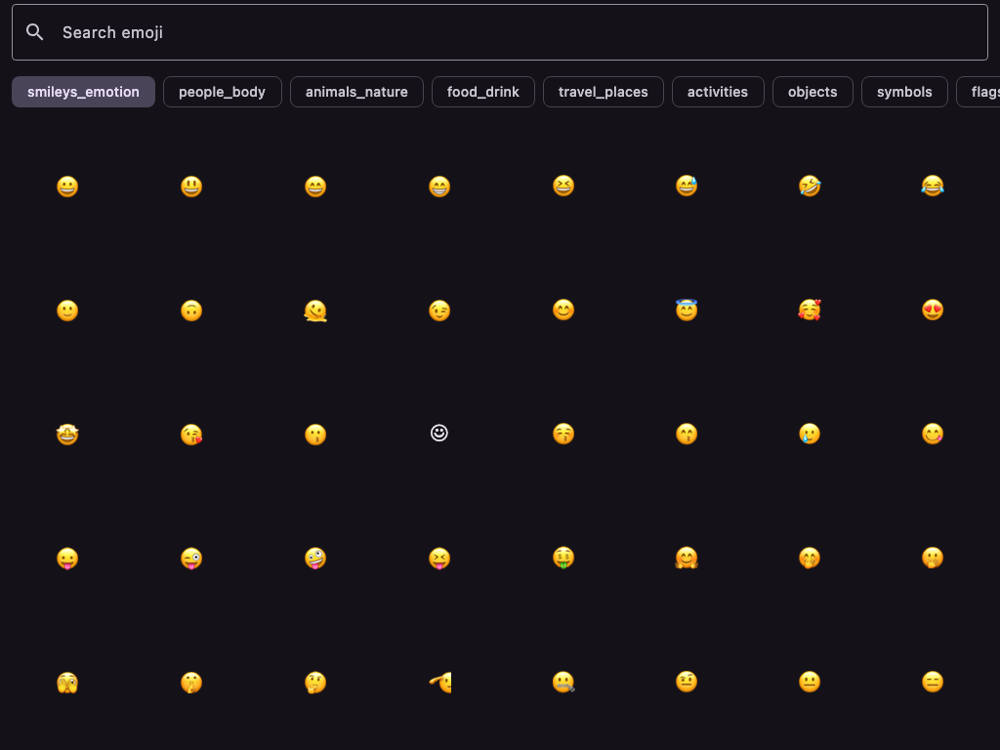

# kmp-emoji-picker

[](https://central.sonatype.com/artifact/me.digitalby/kmp-emoji-picker)
[](LICENSE)
[](https://github.com/digitalby/kmp-emoji-picker/actions/workflows/ci.yml)
[](https://kotlinlang.org/docs/multiplatform.html)
[](https://www.jetbrains.com/lp/compose-multiplatform/)


A Compose Multiplatform emoji picker. Works on Android, iOS, JVM/Desktop, and wasmJs from a single codebase.

<p align="center">
  
  
</p>

## Why

Research in April 2026 confirmed there is no Compose Multiplatform emoji picker. [kosi-libs/Emoji.kt](https://github.com/kosi-libs/Emoji.kt) provides the data layer and renderers across all CMP targets but does not ship a picker UI. Every existing "compose emoji picker" on GitHub (androidx.emoji2.emojipicker, Abhimanyu14/compose-emoji-picker, vanniktech/Emoji, and several others) is Android-only.

This library is a thin UI layer on top of `org.kodein.emoji:emoji-compose-m3`, giving you:

- Category tabs backed by CLDR emoji groups
- Searchable grid with description + shortcode + emoticon matching
- Skin tone selector for `SkinTone1Emoji` and `SkinTone2Emoji`
- Pluggable `RecentEmojiStore` (in-memory default, bring your own persistence)
- Noto SVG fallback on Wasm and Desktop where system fonts lack glyphs (inherited from kosi-libs)

## Install

```kotlin
// settings.gradle.kts
dependencyResolutionManagement {
    repositories {
        mavenCentral()
        google()
    }
}

// picker/build.gradle.kts (commonMain)
dependencies {
    implementation("me.digitalby:kmp-emoji-picker:0.1.0")
}
```

Kotlin Multiplatform produces one artifact per target (`kmp-emoji-picker-android`, `-jvm`, `-iosarm64`, `-iossimulatorarm64`, `-iosx64`, `-wasm-js`) plus a metadata artifact. Gradle's KMP plugin resolves the right one for your target automatically, so you only need to declare the `kmp-emoji-picker` coordinate in `commonMain`.

<details>
<summary>GitHub Packages mirror (optional)</summary>

Each release is also mirrored to GitHub Packages. Authentication is required for reads — generate a Personal Access Token with the `read:packages` scope and expose it as `GITHUB_TOKEN` (with `GITHUB_ACTOR` set to your GitHub username), or set `gpr.user` and `gpr.key` in `~/.gradle/gradle.properties`.

```kotlin
// settings.gradle.kts
dependencyResolutionManagement {
    repositories {
        mavenCentral()
        google()
        maven {
            url = uri("https://maven.pkg.github.com/digitalby/kmp-emoji-picker")
            credentials {
                username = providers.gradleProperty("gpr.user").orNull
                    ?: System.getenv("GITHUB_ACTOR")
                password = providers.gradleProperty("gpr.key").orNull
                    ?: System.getenv("GITHUB_TOKEN")
            }
        }
    }
}
```

</details>

## Usage

```kotlin
import me.digitalby.emojipicker.EmojiPicker
import me.digitalby.emojipicker.rememberEmojiPickerState

@Composable
fun MyScreen(onInsert: (String) -> Unit) {
    val state = rememberEmojiPickerState()
    EmojiPicker(
        state = state,
        onEmojiSelected = { emoji -> onInsert(emoji.details.string) },
    )
}
```

## Targets

- Android (`compileSdk = 35`, `minSdk = 24`)
- iOS (`iosX64`, `iosArm64`, `iosSimulatorArm64`)
- JVM (Desktop)
- wasmJs (browser)

## Accessibility

- `Tab` / `Shift+Tab`: move between search, category tabs, and the grid
- Arrow keys: move focus between emoji cells in the grid
- `Enter` / `Space`: insert the focused emoji
- `Alt+Enter`: open the skin-tone selector for the focused emoji (when supported)
- `Escape`: dismiss the skin-tone popup

Every emoji cell carries `contentDescription` and `Role.Button`, so TalkBack, VoiceOver, and desktop screen readers announce the emoji name and "button" affordance. Tone chips carry per-tone descriptions (e.g. "waving hand, medium dark skin tone").

Emoji with skin-tone variants show a small disclosure triangle in the bottom-right corner of the cell (matching iOS and Android system pickers), and their `contentDescription` is suffixed with "has skin tone variants" so screen readers announce the affordance.

## Localization

Per-emoji names and search keywords ship in 18 locales (en, ru, uk, be, zh, zh-hant, es, fr, de, pt, ja, ko, it, ar, hi, tr, pl, nl), generated from CLDR annotations via the `:picker-codegen` module.

Category tab labels ("Smileys & Emotion", "People", "Animals & Nature", etc.) ship in the same 18 locales, sourced from Apple's `EmojiFoundation.framework/Localizable.loctable` via the public [applelocalization.com](https://applelocalization.com) mirror of macOS/iOS system frameworks. The one label without a direct Apple equivalent — Unicode's `smileys_emotion` group — is hand-authored.

The active locale is detected automatically via each platform's input-method / system locale API. Override via `-Demojipicker.forceLocale=<tag>` for deterministic tests.

## Run the sample

The `sample/composeApp` module dogfoods the picker on every target.

```bash
# Desktop (JVM)
./gradlew :sample:composeApp:run

# Android (device or emulator attached)
./gradlew :sample:composeApp:installDebug

# Web (wasmJs) — serves at http://localhost:8080
./gradlew :sample:composeApp:wasmJsBrowserDevelopmentRun

# iOS — compiles the framework; integrate into your own SwiftUI host
./gradlew :sample:composeApp:linkDebugFrameworkIosSimulatorArm64
```

For iOS, the KMP module exports `MainViewController()`. Wire it into SwiftUI:

```swift
import SwiftUI
import ComposeApp

struct ComposeView: UIViewControllerRepresentable {
    func makeUIViewController(context: Context) -> UIViewController {
        MainViewControllerKt.MainViewController()
    }
    func updateUIViewController(_ vc: UIViewController, context: Context) {}
}
```

## License

MIT
